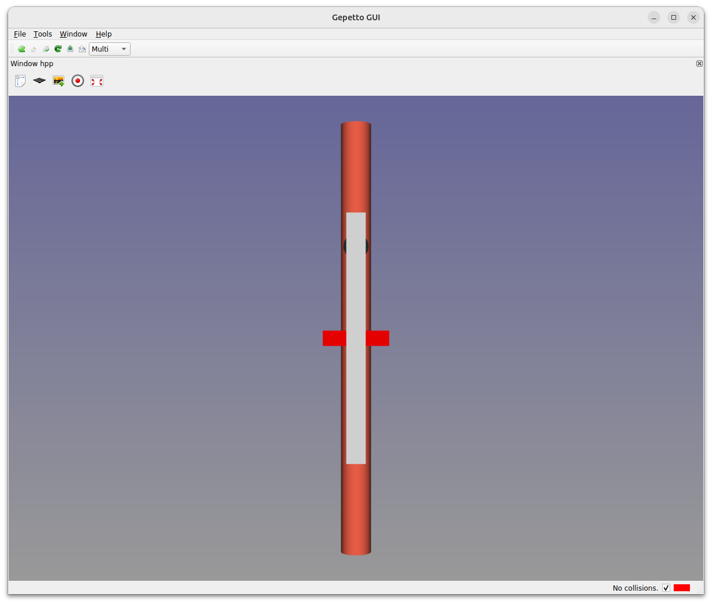
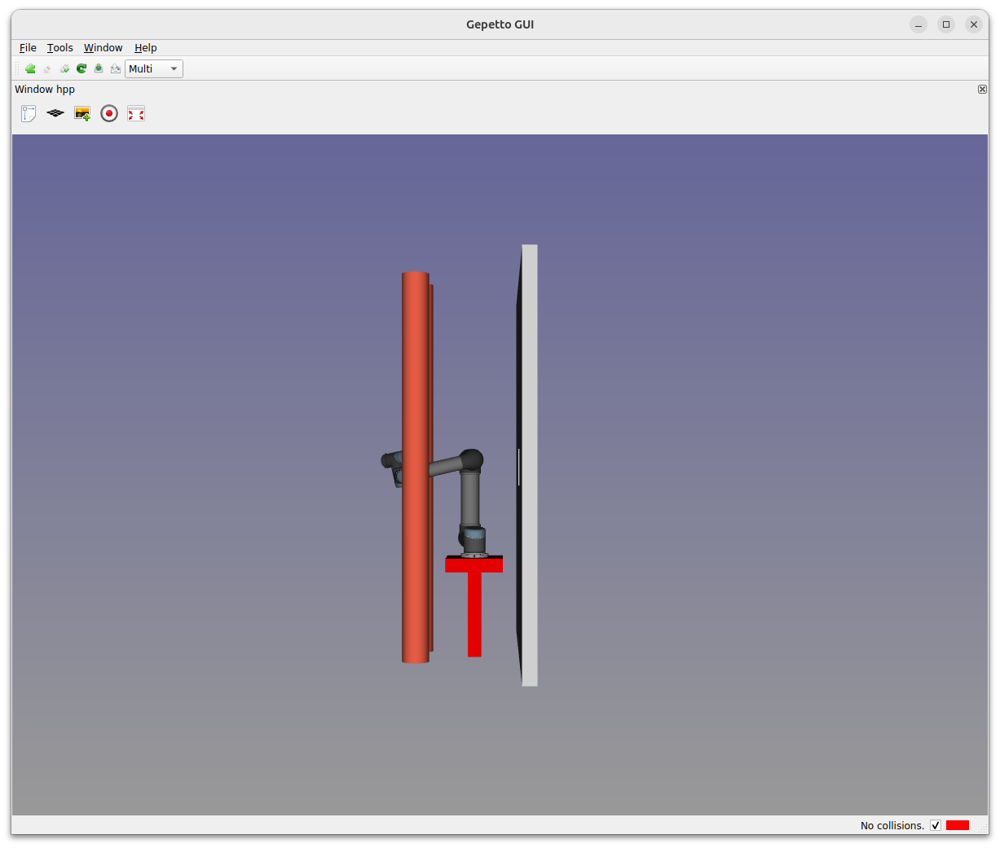

Programming RRT algorithm
=========================

Objective
---------
Program RRT algorithm in python.

Introduction
------------
Open a terminal cd into hpp-practicals directory and open 2 tab by typing CTRL+SHIFT+T.
In the first terminal, type
[source,sh]
----
gepetto-gui -c basic

----

In the second terminal, type
[source,sh]
----
cd script
python -i rrt.py
----

You should see the message "Method solveBiRRT is not implemented yet". Open file +script/motion_planner.py+ in a text editor. The message is produced by method +solveBiRRT+ of class +MotionPlanner+.

Before starting
---------------
HPP objects can be created and accessed directly using boost python bindings.
A roadmap is composed of nodes and edges. Nodes contain configurations. Edges contain paths. The roadmap can be extended using method

* +roadmap.addNodeAndEdges+,

between an existing node of the roadmap and a new configuration.
Calling method +problem.steeringMethod.steer+ creates a new path between two configurations.

See Section "Some useful methods" below.

Displaying a configuration
~~~~~~~~~~~~~~~~~~~~~~~~~~

While running, your RRT algorithm will produce configurations and paths to store in the roadmap
edges. To display a configuration +q+, first create a client to +gepetto-gui+ in the python terminal:
[source,python]
----
>>> v = Viewer(robot)
----

After clicking on the icon "Zoom to fit" (top left, just below "Window hpp"), you should see the following picture.

Then, typing in the python terminal
[source,python]
----
>>> v (q1)
----
You shoud see the robot in configuration +q1+.

Displaying a path
~~~~~~~~~~~~~~~~~

Some functions create paths (+steer+ below for example). Paths can be displayed by using +playPath+ method as follows:

[source,python]
----
>>> v.playPath(path)
----

Hint
~~~~

You can use methods of objects +robot+, +problem+ and +roadmap+.

In +class MotionPlanner+, you can access these object by

[source,python]
----
>>>  self.robot
>>>  self.problem
>>>  self.roadmap
----

Some useful methods
~~~~~~~~~~~~~~~~~~~
[source,python]
----
#
# Note for all the methods below configurations are represented by numpy arrays,
#

# Shoot a random configuration within bounds of robot
#
# return: a configuration
problem.configurationShooter().shoot()

# Get the number of connected components of a roadmap
#
# return: the number of connected components of a roadmap
roadmap.numberConnectedComponents()

# Get i-th connected component
#
#  i index
# return connected component of rank i in the list
#
# warning adding nodes and edges to the roadmap may change the index of a given node.
roadmap.getConnectedComponent(i)

# Get nearest node of given input configuration in a connected component of the  current roadmap
#
#  config:               the input configuration
#  cc    :               a connected component in the roadmap,
# return:                nearest configuration,
#                        distance between nearest configuration and input configuration.
roadmap.nearestNode(config, cc)

# Build direct path between two configurations
#
#  q1, q2:     start and end configurations of the direct path
#
#  return:     the generated path
problem.steeringMethod().steer (q1, q2)

# Validate generated path by steering method
#
#  path:     path previously generated,
#  reverse:  whether the path should be validated from end to beginning, set it to True.
#
#  return:     whether the path is valid,
#              the valid part of the path,
#              a string describing why the path is not valid, or empty string.
#
#  note:       When the path between q1 and q2 is not valid, the method returns
#              a part of the path starting at q1 and ending before collision.
problem.pathValidation().validate(path, reverse)

# Add a node and two edges in the roadmap
#
#  q1: configuration already in the roadmap
#  q2: new configuration
#  path: path between q1 and q2
#
#  note: two nodes are added one between q1 and q2 and one between q2 and q1 so that
#        the roadmap is symmetric.
roadmap.addNodeAndEdges(q1, q2, path)
----

Before starting we recommend that you play a little with the above methods,
creating and displaying some configurations and paths in the +python+ terminal.

Exercise 1
----------

In file +script/motion_planner.py+, remove instruction
[source,python]
----
    print ("Method solveBiRRT is not implemented yet")
----
and implement RRT algorithm between markers
[source,python]
----
      #### RRT begin

      #### RRT end
----
